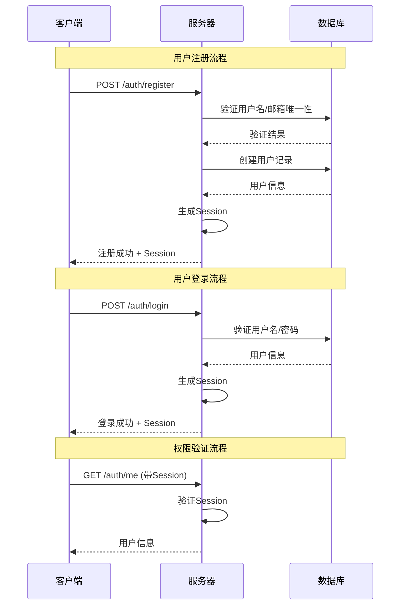

# 美食街管理系统 - 认证接口API文档

## 概述

本文档详细描述了美食街管理系统的用户认证相关API接口，包括用户注册、登录、登出、状态检查等功能。

## 基础信息

- **基础URL**: `http://localhost:8080/api`
- **认证方式**: Session-based Authentication
- **内容类型**: `application/json`
- **字符编码**: `UTF-8`

## 认证流程



## API接口详情

### 1. 用户注册

注册新用户账户，默认为消费者角色。

#### 请求信息

- **URL**: `/auth/register`
- **方法**: `POST`
- **权限**: 无需登录
- **Content-Type**: `application/json`

#### 请求参数

| 字段名 | 类型 | 必填 | 长度限制 | 说明 |
|--------|------|------|----------|------|
| username | String | 是 | 2-50字符 | 用户名，全局唯一 |
| email | String | 是 | 邮箱格式 | 邮箱地址，全局唯一 |
| fullName | String | 是 | 最大100字符 | 用户真实姓名 |
| password | String | 是 | 6-100字符 | 登录密码 |
| confirmPassword | String | 是 | 6-100字符 | 确认密码，必须与password一致 |

#### 请求示例

```json
{
  "username": "newuser",
  "email": "newuser@example.com",
  "fullName": "新用户",
  "password": "123456",
  "confirmPassword": "123456"
}
```

#### 响应信息

**成功响应 (201 Created)**

```json
{
  "token": "1_abc123def456",
  "user": {
    "id": 1,
    "username": "newuser",
    "email": "newuser@example.com",
    "fullName": "新用户",
    "role": "CONSUMER",
    "createdAt": "2024-01-01T10:00:00"
  },
  "message": "登录成功"
}
```

**失败响应 (400 Bad Request)**

```json
{
  "message": "用户名已存在"
}
```

#### 错误码说明

| 错误码 | 说明 |
|--------|------|
| 400 | 请求参数错误 |
| 409 | 用户名或邮箱已存在 |
| 500 | 服务器内部错误 |

---

### 2. 用户登录

用户登录系统，支持用户名或邮箱登录。

#### 请求信息

- **URL**: `/auth/login`
- **方法**: `POST`
- **权限**: 无需登录
- **Content-Type**: `application/json`

#### 请求参数

| 字段名 | 类型 | 必填 | 说明 |
|--------|------|------|------|
| usernameOrEmail | String | 是 | 用户名或邮箱地址 |
| password | String | 是 | 登录密码 |

#### 请求示例

```json
{
  "usernameOrEmail": "admin",
  "password": "123456"
}
```

#### 响应信息

**成功响应 (200 OK)**

```json
{
  "token": "1_abc123def456",
  "user": {
    "id": 1,
    "username": "admin",
    "email": "admin@example.com",
    "fullName": "Administrator",
    "role": "ADMIN",
    "createdAt": "2024-01-01T10:00:00"
  },
  "message": "登录成功"
}
```

**失败响应 (400 Bad Request)**

```json
{
  "message": "用户名或邮箱不存在"
}
```

```json
{
  "message": "密码错误"
}
```

#### 错误码说明

| 错误码 | 说明 |
|--------|------|
| 400 | 用户名/邮箱不存在或密码错误 |
| 500 | 服务器内部错误 |

---

### 3. 用户登出

用户登出系统，清除Session信息。

#### 请求信息

- **URL**: `/auth/logout`
- **方法**: `POST`
- **权限**: 需要登录
- **Content-Type**: `application/json`

#### 请求参数

无需请求参数，通过Session验证用户身份。

#### 响应信息

**成功响应 (200 OK)**

```json
"登出成功"
```

**失败响应 (401 Unauthorized)**

```json
{
  "message": "请先登录"
}
```

---

### 4. 获取当前用户信息

获取当前登录用户的详细信息。

#### 请求信息

- **URL**: `/auth/me`
- **方法**: `GET`
- **权限**: 需要登录
- **Content-Type**: `application/json`

#### 请求参数

无需请求参数，通过Session获取用户信息。

#### 响应信息

**成功响应 (200 OK)**

```json
{
  "id": 1,
  "username": "admin",
  "email": "admin@example.com",
  "fullName": "Administrator",
  "role": "ADMIN",
  "createdAt": "2024-01-01T10:00:00"
}
```

**失败响应 (401 Unauthorized)**

```json
{
  "message": "请先登录"
}
```

---

### 5. 检查登录状态

检查用户是否已登录，无需认证。

#### 请求信息

- **URL**: `/auth/status`
- **方法**: `GET`
- **权限**: 无需登录
- **Content-Type**: `application/json`

#### 请求参数

无需请求参数。

#### 响应信息

**已登录状态 (200 OK)**

```json
{
  "message": "已登录",
  "user": {
    "id": 1,
    "username": "admin",
    "email": "admin@example.com",
    "fullName": "Administrator",
    "role": "ADMIN",
    "createdAt": "2024-01-01T10:00:00"
  }
}
```

**未登录状态 (200 OK)**

```json
{
  "message": "未登录"
}
```

## 数据模型

### UserResponse 用户响应对象

| 字段名 | 类型 | 说明 |
|--------|------|------|
| id | Long | 用户ID |
| username | String | 用户名 |
| email | String | 邮箱地址 |
| fullName | String | 真实姓名 |
| role | String | 用户角色 (ADMIN/MERCHANT/CONSUMER) |
| createdAt | LocalDateTime | 创建时间 |

### AuthResponse 认证响应对象

| 字段名 | 类型 | 说明 |
|--------|------|------|
| token | String | 认证令牌（可选） |
| user | UserResponse | 用户信息（可选） |
| message | String | 响应消息 |

## 角色权限说明

### 用户角色

| 角色 | 代码 | 说明 |
|------|------|------|
| 管理员 | ADMIN | 拥有系统所有权限 |
| 商户 | MERCHANT | 可管理自己的产品和订单 |
| 消费者 | CONSUMER | 可浏览、预订、评价 |

### 权限验证

系统使用AOP（面向切面编程）进行权限验证：

```java
@RequirePermission(roles = {"ADMIN"}, description = "只有管理员可以访问")
@GetMapping("/admin-only")
public ResponseEntity<String> adminOnly() {
    return ResponseEntity.ok("管理员专用接口");
}
```

## 测试用例

### 1. 注册测试

```bash
# 正常注册
curl -X POST http://localhost:8080/api/auth/register \
  -H "Content-Type: application/json" \
  -d '{
    "username": "testuser",
    "email": "test@example.com",
    "fullName": "测试用户",
    "password": "123456",
    "confirmPassword": "123456"
  }'

# 用户名重复
curl -X POST http://localhost:8080/api/auth/register \
  -H "Content-Type: application/json" \
  -d '{
    "username": "admin",
    "email": "test2@example.com",
    "fullName": "测试用户2",
    "password": "123456",
    "confirmPassword": "123456"
  }'
```

### 2. 登录测试

```bash
# 用户名登录
curl -X POST http://localhost:8080/api/auth/login \
  -H "Content-Type: application/json" \
  -d '{
    "usernameOrEmail": "admin",
    "password": "123456"
  }'

# 邮箱登录
curl -X POST http://localhost:8080/api/auth/login \
  -H "Content-Type: application/json" \
  -d '{
    "usernameOrEmail": "admin@example.com",
    "password": "123456"
  }'
```

### 3. 状态检查测试

```bash
# 检查登录状态（未登录）
curl http://localhost:8080/api/auth/status

# 检查登录状态（已登录，需要先登录获取Session）
curl -X POST http://localhost:8080/api/auth/login \
  -H "Content-Type: application/json" \
  -c cookies.txt \
  -d '{"usernameOrEmail": "admin", "password": "123456"}'

curl -b cookies.txt http://localhost:8080/api/auth/status
```

## 前端集成示例

### JavaScript/Axios 示例

```javascript
// 配置axios
const api = axios.create({
  baseURL: 'http://localhost:8080/api',
  withCredentials: true // 重要：支持Session
})

// 用户注册
async function register(userData) {
  try {
    const response = await api.post('/auth/register', userData)
    console.log('注册成功:', response.data)
    return response.data
  } catch (error) {
    console.error('注册失败:', error.response.data.message)
    throw error
  }
}

// 用户登录
async function login(credentials) {
  try {
    const response = await api.post('/auth/login', credentials)
    console.log('登录成功:', response.data)
    return response.data
  } catch (error) {
    console.error('登录失败:', error.response.data.message)
    throw error
  }
}

// 获取当前用户
async function getCurrentUser() {
  try {
    const response = await api.get('/auth/me')
    console.log('当前用户:', response.data)
    return response.data
  } catch (error) {
    console.error('获取用户信息失败:', error.response.data.message)
    throw error
  }
}

// 用户登出
async function logout() {
  try {
    const response = await api.post('/auth/logout')
    console.log('登出成功:', response.data)
    return response.data
  } catch (error) {
    console.error('登出失败:', error.response.data.message)
    throw error
  }
}
```

### Vue.js 示例

```vue
<template>
  <div>
    <!-- 登录表单 -->
    <el-form @submit.prevent="handleLogin">
      <el-form-item>
        <el-input v-model="loginForm.usernameOrEmail" placeholder="用户名或邮箱" />
      </el-form-item>
      <el-form-item>
        <el-input v-model="loginForm.password" type="password" placeholder="密码" />
      </el-form-item>
      <el-form-item>
        <el-button type="primary" @click="handleLogin">登录</el-button>
      </el-form-item>
    </el-form>
  </div>
</template>

<script setup>
import { ref, reactive } from 'vue'
import { useAuthStore } from '@/stores/auth'

const authStore = useAuthStore()

const loginForm = reactive({
  usernameOrEmail: '',
  password: ''
})

const handleLogin = async () => {
  try {
    await authStore.loginUser(loginForm)
    console.log('登录成功')
  } catch (error) {
    console.error('登录失败:', error.message)
  }
}
</script>
```

## 错误处理

### 常见错误及解决方案

| 错误信息 | 原因 | 解决方案 |
|----------|------|----------|
| "用户名已存在" | 用户名重复 | 更换用户名 |
| "邮箱已被注册" | 邮箱重复 | 更换邮箱或使用登录功能 |
| "密码和确认密码不匹配" | 两次密码输入不一致 | 重新输入确认密码 |
| "用户名或邮箱不存在" | 用户不存在 | 检查用户名/邮箱或先注册 |
| "密码错误" | 密码不正确 | 检查密码输入 |
| "请先登录" | 未登录状态 | 先调用登录接口 |
| "权限不足" | 角色权限不够 | 联系管理员分配权限 |

### HTTP状态码

| 状态码 | 说明 |
|--------|------|
| 200 | 请求成功 |
| 201 | 创建成功（注册） |
| 400 | 请求参数错误 |
| 401 | 未授权（未登录） |
| 403 | 权限不足 |
| 409 | 资源冲突（用户名/邮箱重复） |
| 500 | 服务器内部错误 |

## 安全建议

### 生产环境配置

1. **密码加密**: 使用BCrypt等安全算法加密密码
2. **HTTPS**: 生产环境必须使用HTTPS
3. **Session安全**: 配置安全的Session参数
4. **输入验证**: 加强输入参数验证
5. **日志记录**: 记录认证相关操作日志

### 安全配置示例

```yaml
# application.yml
server:
  servlet:
    session:
      cookie:
        secure: true
        http-only: true
        same-site: strict
      timeout: 30m
```

## 更新日志

| 版本 | 日期 | 更新内容 |
|------|------|----------|
| 1.0.0 | 2024-01-01 | 初始版本，包含基础认证功能 |

## 联系支持

如有问题或建议，请联系开发团队：

- **邮箱**: dev@example.com
- **文档**: [项目文档](http://localhost:8080/api/docs)
- **API测试**: [Swagger UI](http://localhost:8080/api/swagger-ui.html)
